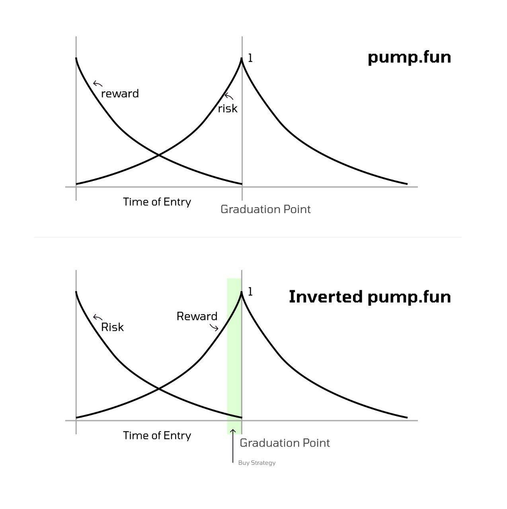

# Vestige

**Privacy-preserving token launchpad on Solana.** Commit SOL in private using MagicBlock Ephemeral Rollups (TEE); reveal totals only at graduation. Fair price discovery without revealing your hand.

---

## Links

| | |
|---|---|
| **Live app** | [**https://vestige-eight.vercel.app/**](https://vestige-eight.vercel.app/) |
| **Demo video** | [**https://youtu.be/aJsDFx8rhUM**](https://youtu.be/aJsDFx8rhUM) |

---

## Our ideology: Inverted pump.fun

Vestige flips the usual token-launch risk/reward curve so that the best time to act is **at graduation**, not before.

| | **pump.fun (traditional)** | **Inverted pump.fun (Vestige)** |
|---|---|---|
| **Reward** | High for early entry, decreases toward graduation | Low early, **increases** toward graduation |
| **Risk** | Low early, **increases** toward graduation | High early, **decreases** toward graduation |
| **Optimal strategy** | Front-run early (reveals intent, copyable) | **Buy / commit at graduation** — max reward, min risk |

In the traditional model, early entrants get high reward but everyone can see who’s in, which encourages front-running and copy-trading. In Vestige, **commitments are private** until graduation. Price discovery happens inside the TEE; only at the **Graduation Point** do we settle to Solana and reveal totals. The “Buy Strategy” is at graduation: participants finalize and claim when risk is lowest and reward is highest.



*(Add your diagram as `docs/ideology-diagram.png` to display it above.)*

---

## What we built

### For creators

1. **Create Launch** — Set token supply, graduation target (SOL), min/max commitment, duration. We create the SPL mint, initialize the launch and vault PDAs, create your token vault (ATA), and mint the full supply so claims work.
2. **Launch PDA in the UI** — After creation, the Launch PDA is shown and copyable; **“Open launch page”** takes you straight to the launch detail.
3. **Enable Private Mode (TEE)** — One-click: create permission, delegate commitment pool + vault + ephemeral SOL accounts to MagicBlock’s TEE validator, mark launch as delegated. Private commits are now allowed.
4. **Graduate & Settle** — **Graduate & Undelegate** (atomic on Ephemeral Rollup) then **Finalize graduation** on Solana to sync pool totals to the launch account.
5. **Withdraw Collected SOL** — Pull SOL from the launch vault to your wallet.

### For participants

1. **Discover / Open by PDA** — Discover page lists launches (or paste a Launch PDA from the creator).
2. **Commit privately** — On launch detail: enter amount, commit. SOL is funded into your **ephemeral SOL** account on Solana, then **private_commit** runs on the TEE so amount and timing are hidden on-chain until graduation.
3. **After graduation** — **Undelegate my commitment** and **Undelegate my ephemeral SOL** (so accounts return to Solana), then **Sweep my ephemeral SOL to Vault** (moves your committed SOL into the launch vault).
4. **My Commitments** — Enter Launch PDA → **Load** → **Calculate Allocation** (time-weighted + early bonus). If needed, **Create token account** then **Claim tokens**.

### Tech highlights

- **Solana (Anchor):** PDAs for launch, commitment pool, user commitment, vault, ephemeral SOL; SPL mint/ATA; full flow from `initialize_launch` to `claim_tokens` and `withdraw_funds`.
- **MagicBlock Ephemeral Rollups:** `ephemeral_rollups_sdk` (v0.8); TEE for private commits; delegate/undelegate lifecycle; permission program; routing so private instructions run on TEE RPC and settlement on Solana.
- **Frontend (Next.js):** Wallet connect, Create Launch (with PDA + open launch page), Launch Detail with MagicBlock controls, Discover, My Commitments / Allocation (load by PDA, calculate, create ATA, claim). Toasts instead of alerts; live-ticking stats and charts for demo feel.

---

## Architecture (high level)

```
┌─────────────────────────────────────────────────────────────────────────┐
│  User (Creator / Participant)                                           │
└────────────────────────────────┬───────────────────────────────────────┘
                                 │
                                 ▼
┌─────────────────────────────────────────────────────────────────────────┐
│  Frontend (Next.js) — vestige-eight.vercel.app                          │
│  Wallet adapter, Vestige client, MagicBlock client (base vs TEE routing) │
└────────────────────────────────┬───────────────────────────────────────┘
                                 │
         ┌───────────────────────┼───────────────────────┐
         ▼                       ▼                       ▼
┌─────────────────┐   ┌─────────────────────┐   ┌─────────────────────────┐
│  Solana (base)  │   │  MagicBlock ER/TEE  │   │  Magic Router            │
│  Init, delegate │   │  private_commit     │   │  Route by account state  │
│  finalize,      │   │  graduate_and_      │   │  (base vs ER)            │
│  claim, withdraw│   │  undelegate         │   │                          │
└─────────────────┘   └─────────────────────┘   └─────────────────────────┘
```

- **Base layer (Solana):** Launch and vault PDAs, SPL mint/ATA, user commitment and ephemeral SOL PDAs; init, delegate, fund_ephemeral, sweep_ephemeral_to_vault, finalize_graduation, calculate_allocation, claim_tokens, withdraw_funds.
- **Ephemeral Rollup (TEE):** Delegated accounts only. private_commit (amount/timing hidden), graduate_and_undelegate (atomic settlement back to Solana).
- **Router:** Picks base vs ER RPC so the right instructions hit the right layer.

---

## Sponsor technologies

- **Solana** — Program deployment, PDAs, SPL token (mint, ATA, transfer), SOL vault, Clock for launch timing.
- **MagicBlock Ephemeral Rollups** — `ephemeral_rollups_sdk` with Anchor and access-control; TEE validator for private execution; delegate/undelegate; CPI for delegation and `commit_and_undelegate_accounts`; permission program. Private commitments and graduation run on the Ephemeral Rollup so on-chain data stays hidden until settlement.

---

## Repo structure

```
Vestige/
├── programs/vestige/     # Anchor program (Solana + MagicBlock ER flows)
├── frontend/             # Next.js app (Discover, Creator, Launch Detail, Allocation)
├── lib/                  # vestige-client, magicblock-client, use-vestige
├── migrations/
├── tests/
└── docs/                 # ideology-diagram.png (add your diagram here)
```

---

## Run locally

**Program (Solana)**

```bash
anchor build
anchor deploy --provider.cluster devnet   # or localnet
```

**Frontend**

```bash
cd frontend
cp .env.example .env   # set NEXT_PUBLIC_* if needed
npm install
npm run dev
```

Open [http://localhost:3000](http://localhost:3000). Use **Discover → Open a launch by PDA** or **Creator → Create Launch** to get a Launch PDA, then open the launch and follow Enable Private Mode → Commit (as participant) → Graduate → Finalize → Sweep → Claim.

---

## Roadmap

- **Discovery:** Index active/graduated launches from chain or indexer so Discover shows real list + “Open by PDA”.
- **Post-graduation analytics:** Commitment distribution, time-weighted stats, export for creators.
- **Program:** Optional cap on total allocated vs supply; configurable early-bonus curve.
- **UX:** “My Launches” / “My Commitments” from history; notifications when a launch graduates or allocation is ready.
- **Security & docs:** Audit of delegate/undelegate and sweep; runbooks for creators and participants.

---

© 2026 Vestige Labs.
